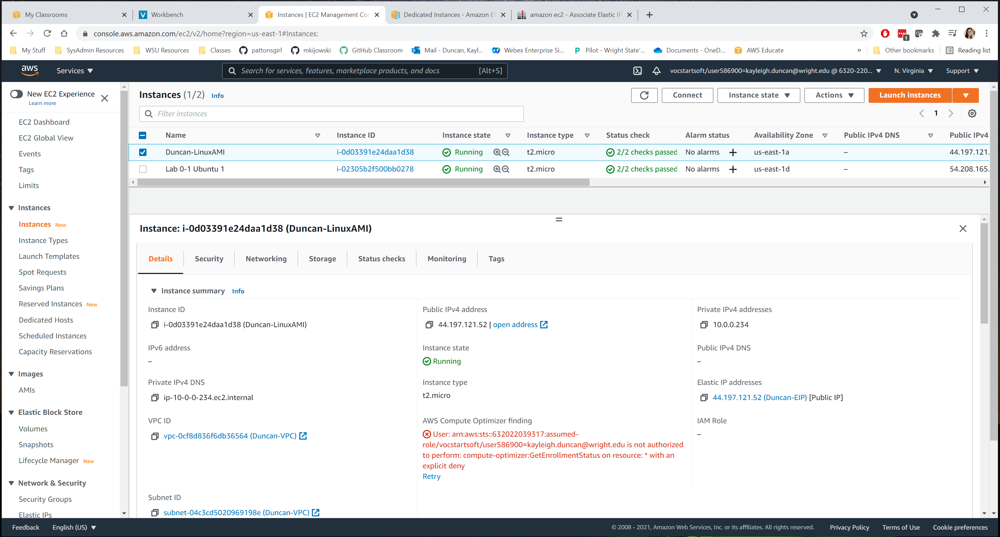

# Project 2

## Objectives:

- Understand and build a private cloud network
- Understand and build an EC2 instance

## Assignment Notes / Hints

For this project you need access to your AWS console. [Return to here and click "Start Lab"](https://awsacademy.instructure.com/courses/13269/modules/items/1137325). **Once the icon next to "AWS" is green, click "AWS" to open the console.**

Create a `Project2` folder in your GitHub Classrooms repo. This project is mostly documentation of work, so you are welcome to work wherever you are comfortable. I would float towards VSCode myself.

In your `Project2` folder, create a file named `README.md` Do you work for Parts 1 & 2 here.

- It will be handy, but not necessary, to compare / contrast the resources you are making with the working "stack" you have. That stack is based on a template, and that template defined all of these resources - and worked.
- When asked to create "tags", you want to make a "Name" tag and then write the name in the value field. Sometimes the "Name" tag will be autofilled for you. Sometimes not.
- If you get to a point where you need to start over, carefully go through and delete the resources you have already created.
  1. This is good maintainence. Leaving behind junk is frowned upon in any industry
  2. This will keep you from running resources you can be charged for (like unused instances and elastic IPs)

## Part 1 - Build a VPC

For each step below, provide a screenshot that shows the network resource has been created according to specification along with a description of what the resource does (what is its role). You may add whatever additional notes you would like. **The screenshot and description of each network component is required**. Any other notes you leave behind may make this project more useful in the future. Getting a good screenshot can be done by clicking on the resource and showing configurations in the details menu.

1. Create a VPC.
   - Tag it with "YOURLASTNAME-VPC"
   - Specify a /24 private IP address range
2. Create a subnet
   - Tag it with "YOURLASTNAME-Subnet"
   - Specify a /28 private IP address range
   - Attach it to your VPC
3. Create an internet gateway
   - Tag it with "YOURLASTNAME-gw"
   - Attach it to your VPC
4. Create a route table
   - Tag it with "YOURLASTNAME-routetable"
   - Attach it to your VPC
   - Associate it with your subnet
   - Add a routing table rule that sends traffic to all destinations to your internet gateway
5. Create a security group
   - Tag it with "YOURLASTNAME-sg"
   - Allow SSH for a set of trusted networks including:
     - Your home / where you usually connect to your instances from
     - Wright State (addresses starting with 130.108)
     - Instances within the VPC
   - Attach it to your VPC
   - Image should include your Inbound rules
6. (If necessary, else skip) Create a key pair

## Part 2 - EC2 instances

1. Create a new instance. Give a write up of the following information:
   - AMI selected
     - default username of the instance type selected
   - Instance type selected
2. Attach the instance to your VPC. As discussed there are different pathways to doing this. Say how you did it.
3. Determine whether a Public IPv4 address will be auto-assigned to the instance. Justify your choice to do so (or not do so)
   - **NOTE** - in the next few steps, you will be required to request an Elastic IP address and associate it to the instance. Factor that in to your discussion here.
4. Attach a volume to your instance. As discussed there are different pathways to doing this. Say how you did it.
5. Tag your instance with a "Name" of "YOURLASTNAME-instance". Say how you did it.
6. Associate your security group, "YOURLASTNAME-sg" to your instance. Say how you did it.
7. Reserve an Elastic IP address. Tag it with "YOURLASTNAME-EIP". Associate the Elastic IP with your instance. Say how you did it.
8. Create a screenshot your instance details and add it to your project write up. Example below:
   
9. `ssh` in to your instance. Change the hostname to "YOURLASTNAME-AMI" where AMI is some version of the AMI you chose. Say how you did it.
   1. It is wise to copy config files you are about to change to filename.old For `/etc/hostname`, for example, I would first copy the current `hostname` file to `/etc/hostname.old`
   2. You should not change permissions on any files you are modifying. They are system config files. You may need to access them with adminisrative privileges.
   3. Here is a helpful resource: https://www.tecmint.com/set-hostname-permanently-in-linux/ I did not modify `/etc/hosts` on mine - do so or not as you wish.
10. Create a screenshot your ssh connection to your instance and add it to your project write up - make sure it shows your new hostname.

## Submission

1. Commit and push your changes to your repository. Verify that these changes show in your course repository, https://github.com/WSU-kduncan/ceg3120-YOURGITHUBNAME

   - Your repo should contain:
   - `images` folder (optional depending on how you implement screenshots)
   - `README.md`

2. In Pilot, paste the link to your project folder. Sample link: https://github.com/WSU-kduncan/ceg3120-YOURGITHUBUSERNAME/blob/main/Projects/Project2

3. You may delete all created resources once done to save monies. No really, trash it - especially the instance and disassociate and release the elastic ip

## Rubric

[Link to Rubric](Rubric.md)
